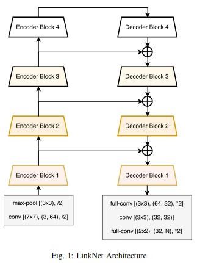
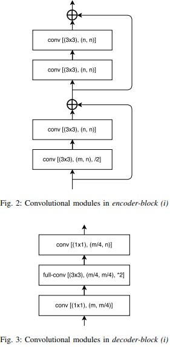
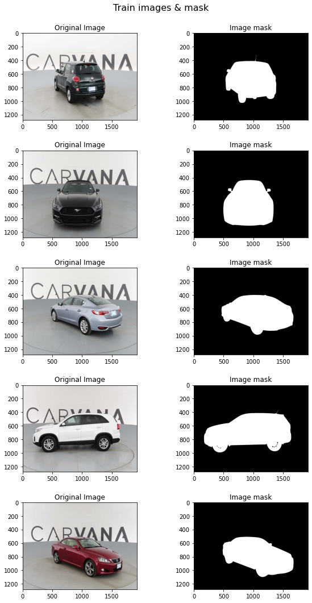
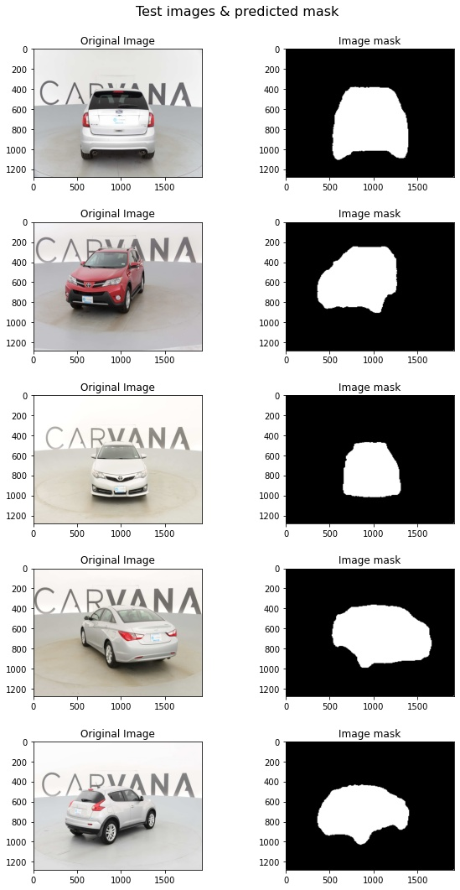
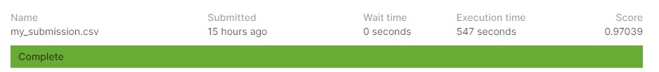

# Carvana Image Masking Challengehttps

Solution in Kaggle [Carvana Image Masking Challengehttps](https://www.kaggle.com/c/carvana-image-masking-challenge/overview).

The goal is automatically identify the boundaries of the car in an image.

My approach based on using [LinkNet18](https://arxiv.org/pdf/1707.03718.pdf). This is a neural net for a semantic segmentation using encoder decoder approach. 
As an encoder I used pre-trained ResNet18. All implementation done using PyTorch.

* [Notebook with training process](carvana_train.ipynb)
* [Notebook with evaluation process](carvana_eval.ipynb)
* [Data visualization](carvana_visualization.ipynb)

### Model architecture
 

## Data visualization
 

## Kaggle submission
